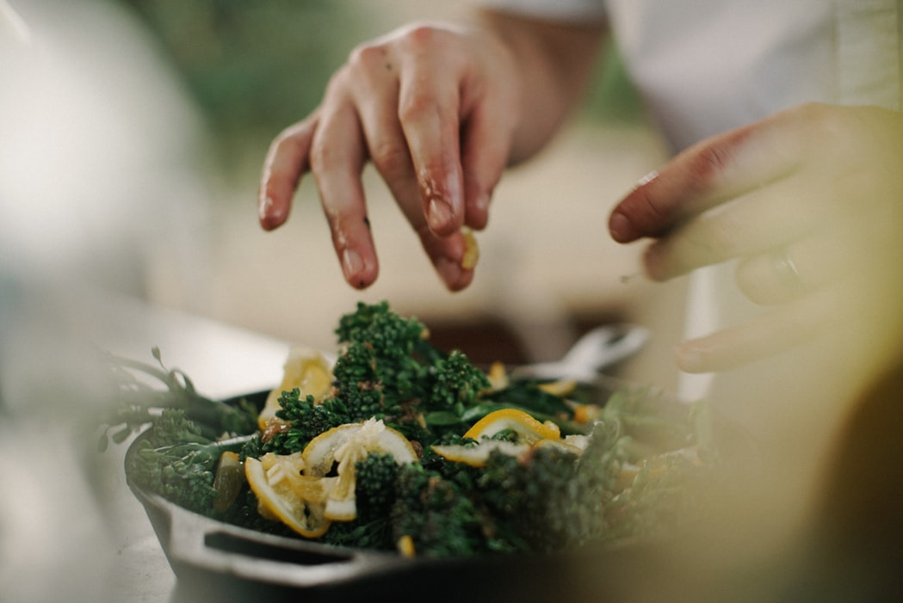
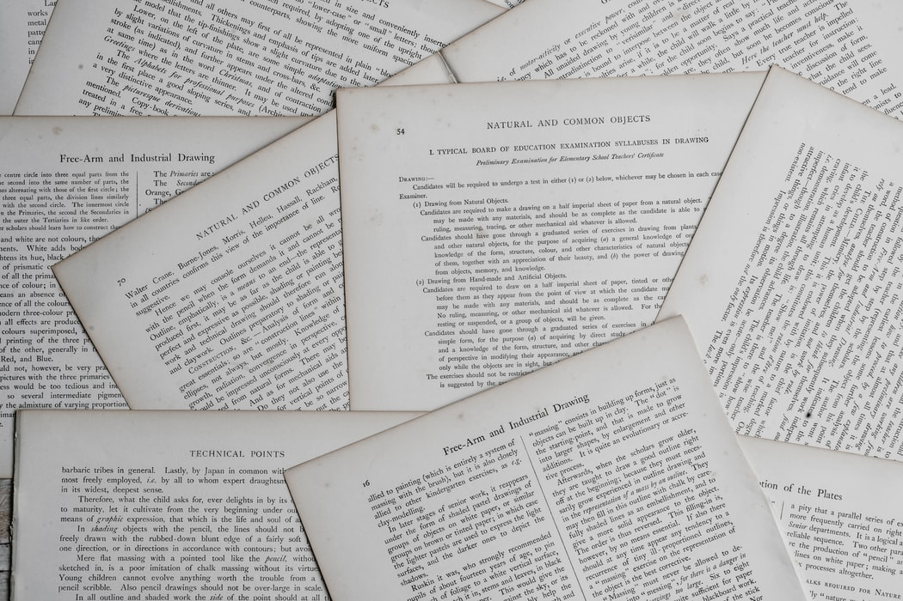

# CookingPaper
Writing a paper on cooking process just for fun and practice  

(~~유산지가 아니다~~) 요리 준비부터 플레이팅까지 논문형식으로 정리해보자  

[[왜 내가 만드는 알리오올리오는 항상 맛이 없는가에 관한 고찰 - Kim]](papers/aglio_e_olio)

# 참고 사이트

[논문 형식 / 꺼무위키](https://namu.wiki/w/논문/형식)

[논문 형식 / 블로그](https://m.blog.naver.com/PostView.nhn?blogId=moses3650&logNo=221197908820&proxyReferer=https%3A%2F%2Fwww.google.com%2F)  

[논문 형식 / 연세대 수업 pdf](http://cs.yonsei.ac.kr/capstone/wp-content/uploads/2016/03/논문작성법통합수업.pdf)  

[논문 제목 / 블로그](https://m.post.naver.com/viewer/postView.nhn?volumeNo=16777548&memberNo=11881892)
